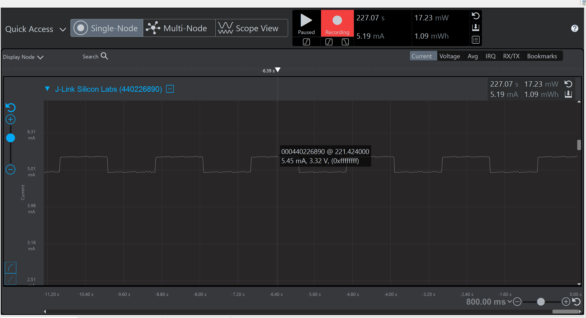
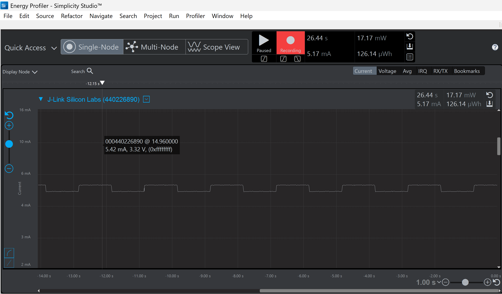
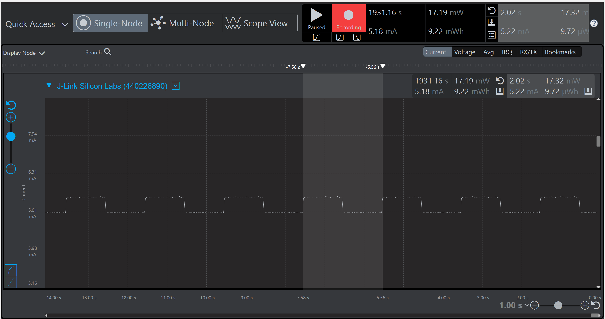
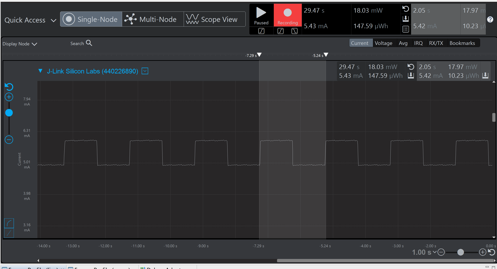

Note: For all assignments and Energy Profiler measurements you’ll be taking this semester,  Peak measurements are instantaneous measurements taken at a specific point in time. In the Energy Profiler, this is accomplished by left-clicking at a location along the time axis.
Average measurements are measurements that are taken over a time-span. In the Energy Profiler, this is accomplished by left-clicking and dragging a region along the time axis.

Please include your answers to the questions below with your submission, entering into the space below each question
See [Mastering Markdown](https://guides.github.com/features/mastering-markdown/) for github markdown formatting if desired.

**1. How much current does the system draw (instantaneous measurement) when a single LED is on with the GPIO pin set to StrongAlternateStrong?**
   Answer:The LED0 is ON in a blinking pattern being 1sec on and 1sec off and the instantaneous current shown is 5.45mA when my LED0 pin is set in StrongAlternateStrong
   
   

**2. How much current does the system draw (instantaneous measurement) when a single LED is on with the GPIO pin set to WeakAlternateWeak?**
   Answer:The LED0 is ON in a blinking pattern being 1sec on and 1sec off and the instantaneous current shown is 5.45mA when my LED0 pin is set in WeakAlternateWeak
 

**3. Is there a meaningful difference in current between the answers for question 1 and 2? Please explain your answer, referencing the main board schematic, WSTK-Main-BRD4001A-A01-schematic.pdf or WSTK-Main-BRD4002A-A06-schematic.pdf, and AEM Accuracy in the ug279-brd4104a-user-guide.pdf. Both of these PDF files are available in the ECEN 5823 Student Public Folder in Google drive at: https://drive.google.com/drive/folders/1ACI8sUKakgpOLzwsGZkns3CQtc7r35bB?usp=sharing . Extra credit is available for this question and depends on your answer.**
   Answer:In Question 1, the measured current is 5.45 mA, and in Question 2, it's 5.42 mA, which means there's only a little difference of 0.03 mA. This small difference is negligible as it is within the accuracy range of the Advanced Energy Monitor (AEM), which has an accuracy of ±0.1 mA for currents greater than 250 µA. So, basically the current values are the same within the measurement limits.

   Looking at the board schematics the LED circuit has a resistor in series. Using Ohm’s Law the expected current that led will draw is around 0.5mA therfore The current remains almost the same in both strong and weak drive settings because the LED and resistor primarily control it. Even though the weak drive can provide 1 mA and the strong drive up to 10 mA, the circuit limits the current to what's needed, ensuring proper LED illumination without noticeable differences in brightness or power consumption
 
   Although the drive strength in this case is only affecting the slew rate, like how fast the signal switches ON and OFF. But it doesn't really change the steady current flowing through the LED 

**4. With the WeakAlternateWeak drive strength setting, what is the average current for 1 complete on-off cycle for 1 LED with an on-off duty cycle of 50% (approximately 1 sec on, 1 sec off)?**
   Answer:Average current for 1 complete on-off cycle for LED0 being 1 sec on and 1 sec off in the WeakAlternateWeak drive strength is 5.22mA

   

**5. With the WeakAlternateWeak drive strength setting, what is the average current for 1 complete on-off cycle for 2 LEDs (both on at the time same and both off at the same time) with an on-off duty cycle of 50% (approximately 1 sec on, 1 sec off)?**
   Answer:Average current for 1 complete on-off cycle for both LED0 and LED1 both being 1 sec on and 1 sec off in the WeakAlternateWeak drive strength is 5.42mA

   

