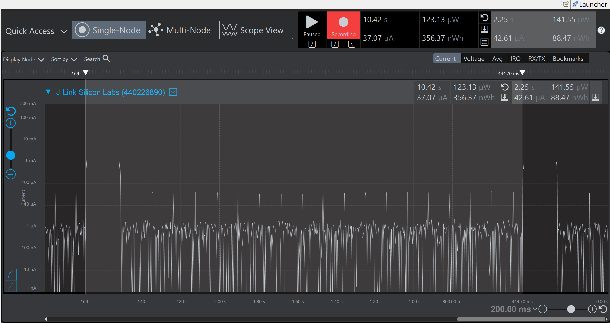

Please include your answers to the questions below with your submission, entering into the space below each question
See [Mastering Markdown](https://guides.github.com/features/mastering-markdown/) for github markdown formatting if desired.

**Note: All current measurements shall be taken at a 2.25 second period with an LED on-time of 175ms. All average currents should be taken at a time scale of 200mS/div. See the pop-up menu in the lower-right corner of the Energy Profiler window**

**1. Fill in the below chart based on currents measured in each energy mode, replacing each TBD with measured values.  Use the [Selecting Ranges](https://www.silabs.com/documents/public/user-guides/ug343-multinode-energy-profiler.pdf) feature of the profiler to select the appropriate measurement range.  Your measurements should be accurate to 10%**

Energy Mode | Period (ms) | LED On Time (ms) |Period average current (uA) | Average Current with LED off (uA) | Average Current with LED On (uA)
------------| ------------|------------------|----------------------------|-----------------------------------|---------------------------------
EM0         |    2250     |       174        |          5340              |           5300                    |         5770
EM1         |    2250     |       178        |          3730              |           3680                    |         4140
EM2         |    2250     |       178        |          42.61             |           3.77                    |         487.80
EM3         |    2240     |       172        |          41.94             |           2.03                   |         498.54

**2. ScreenShots**  

***EM0***  
Period average current    

Average Current with LED ***off***  
!
Average Current with LED ***on***  
!

***EM1***  
Period average current    

Average Current with LED ***off***  
 
Average Current with LED ***on***  
!  

***EM2***  
Period average current  
  
Average Current with LED ***off***  
 
Average Current with LED ***on***  
  
LED measurement - Period   
 
LED measurement - LED on time   
 

***EM3***  
Period average current    

Average Current with LED ***off***  
  
Average Current with LED ***on***  
   
LED measurement - Period   

LED measurement - LED on time   

[em0_avg_current_period]: screenshots/em0_avg_current_period.jpg "em0_avg_current_period"
[em0_avg_current_ledoff]: screenshots/em0_avg_current_ledoff.jpg "em0_avg_current_ledoff"
[em0_avg_current_ledon]: put-your-link-to-screenshot-image-here "em0_avg_current_ledon"

[em1_avg_current_period]: put-your-link-to-screenshot-image-here "em1_avg_current_period"
[em1_avg_current_ledoff]: put-your-link-to-screenshot-image-here "em1_avg_current_ledoff"
[em1_avg_current_ledon]: put-your-link-to-screenshot-image-here "em1_avg_current_ledon"

[em2_avg_current_period]: put-your-link-to-screenshot-image-here "em2_avg_current_period"
[em2_avg_current_ledoff]: put-your-link-to-screenshot-image-here "em2_avg_current_ledoff"
[em2_avg_current_ledon]: put-your-link-to-screenshot-image-here "em2_avg_current_ledon"
[em2_led_period]: put-your-link-to-screenshot-image-here "em2_led_period"
[em2_led_ledOnTime]: put-your-link-to-screenshot-image-here "em2_led_ledOnTime"

[em3_avg_current_period]: put-your-link-to-screenshot-image-here "em3_avg_current_period"
[em3_avg_current_ledoff]: put-your-link-to-screenshot-image-here "em3_avg_current_ledoff"
[em3_avg_current_ledon]: put-your-link-to-screenshot-image-here "em3_avg_current_ledon"
[em3_led_period]: put-your-link-to-screenshot-image-here "em3_led_period"
[em3_led_ledOnTime]: put-your-link-to-screenshot-image-here "em3_led_ledOnTime"
