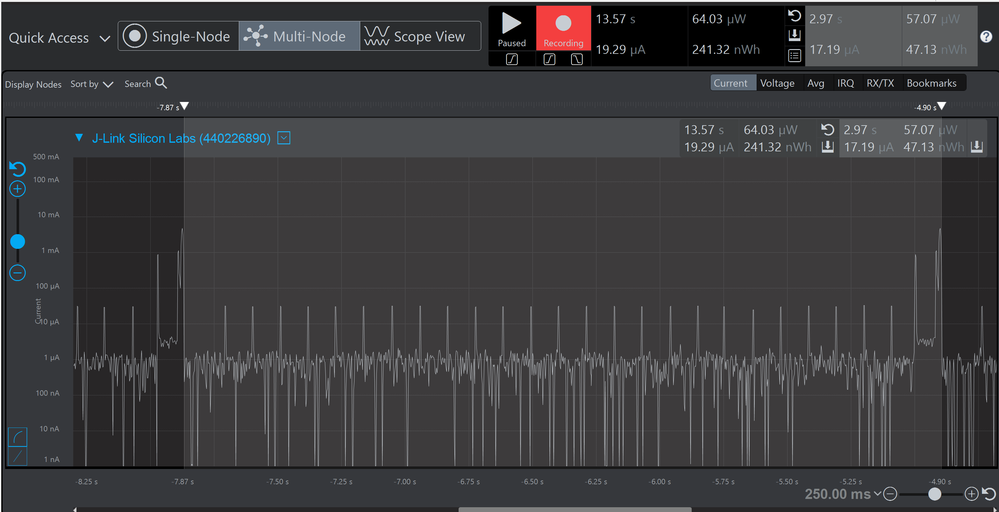
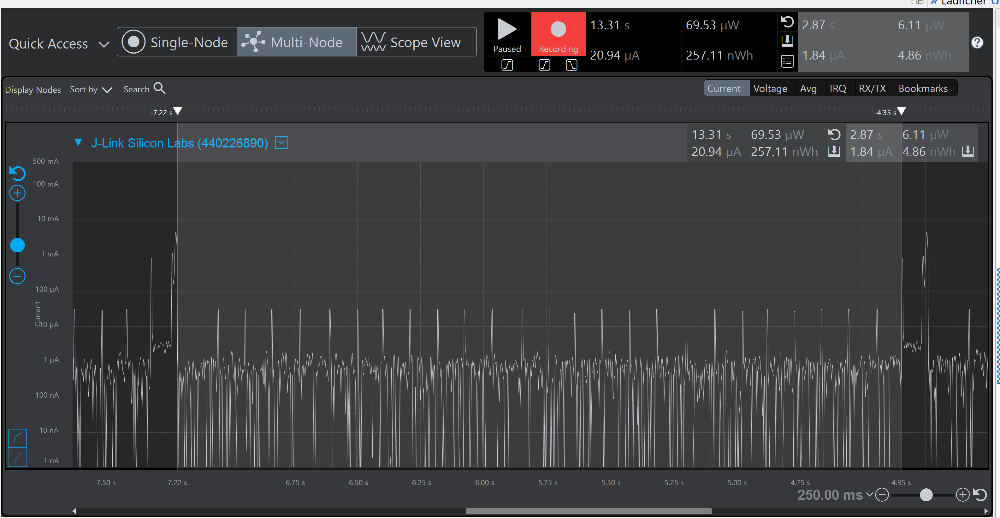
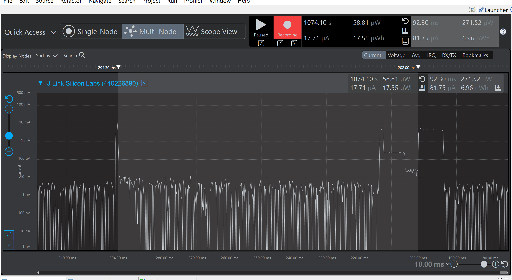
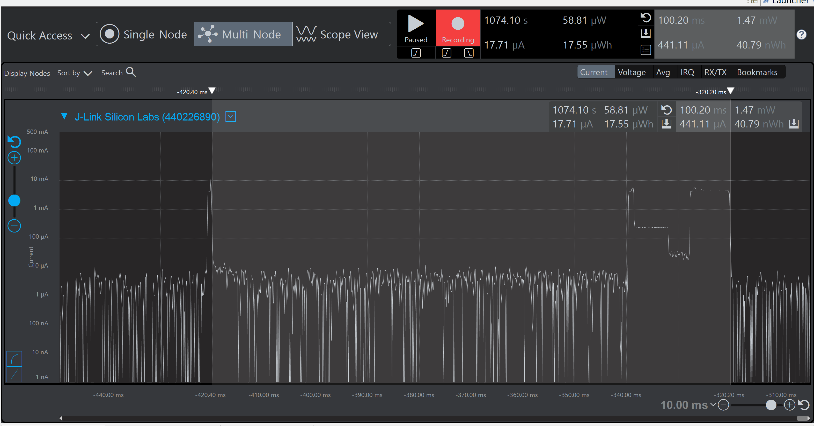

Please include your answers to the questions below with your submission, entering into the space below each question
See [Mastering Markdown](https://guides.github.com/features/mastering-markdown/) for github markdown formatting if desired.

*Be sure to take measurements with logging disabled to ensure your logging logic is not impacting current/time measurements.*

*Please include screenshots of the profiler window detailing each current measurement captured.  See the file Instructions to add screenshots in assignment.docx in the ECEN 5823 Student Public Folder.* 

1. What is the average current per period? (Remember, once you have measured your average current, average current is average current over all time. Average current doesn’t carry with it the units of the timespan over which it was measured).
   Answer:17.19uA
    Screenshot:  
   

2. What is the ave current from the time we sleep the MCU to EM3 until we power-on the 7021 in response to the LETIMER0 UF IRQ?
   Answer:1.84uA
    Screenshot:  
   

3. What is the ave current from the time we power-on the 7021 until we get the COMP1 IRQ indicating that the 7021's maximum time for conversion (measurement) has expired.
   Answer:81.75uA
    Screenshot:  
     

4. How long is the Si7021 Powered On for 1 temperature reading?
   Answer:100.20ms
    Screenshot:  
    

5. Given the average current per period from Q1, calculate the operating time of the system for a 1000mAh battery? - ignoring battery manufacturers, efficiencies and battery derating - just a first-order calculation.
   Answer (in hours):52880.7 hours
   Operating Time (hours) = Battery Capacity (mAh) / Average Current (mA)
   Therfore 1000mAh/0.01719mA = 58173.35 hours

​
   
6. How has the power consumption performance of your design changed since the previous assignment?
   Answer: In the assignment 3 we used timerwait as polled and I2C as a Blocking, which makes the system to be in on state and consume power much more. In this Assignment we have implemented both timerwait and I2C using interrupt which helps us to set the board to sleep in idle state (during I2C transfer). Both period Average current from 155.22uA to 17.19uA and power-on - Conversion time average current from 4.93mA to 81.75uA is very less compared to assignment 3. So the system now is more power-efficient.
   

